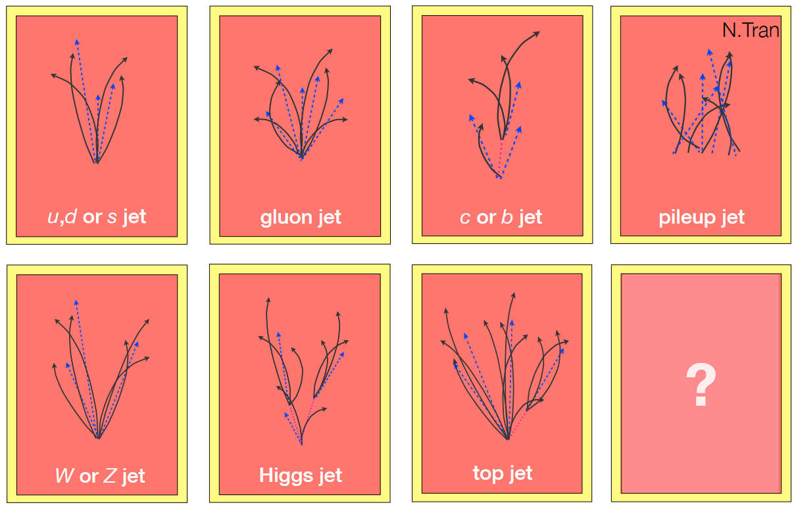
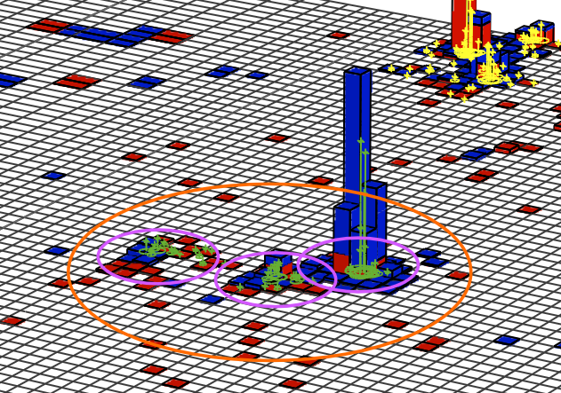
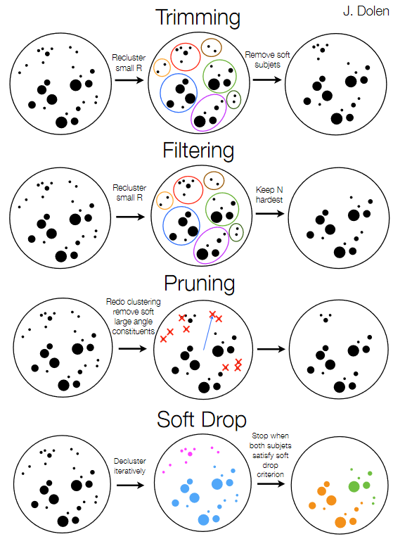
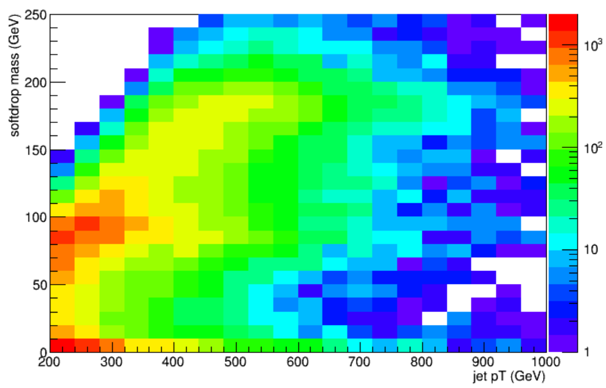
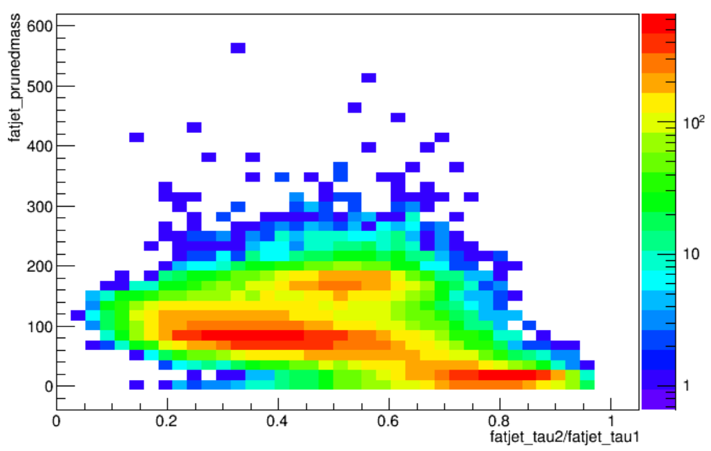
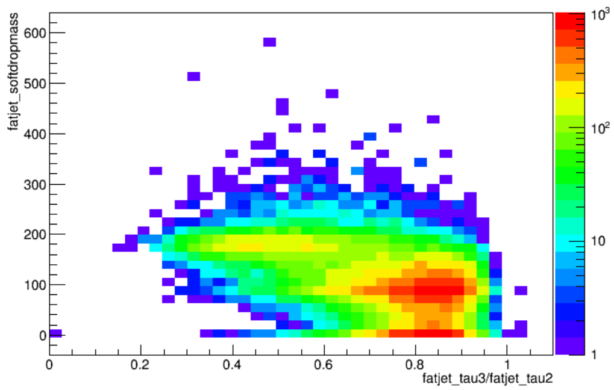
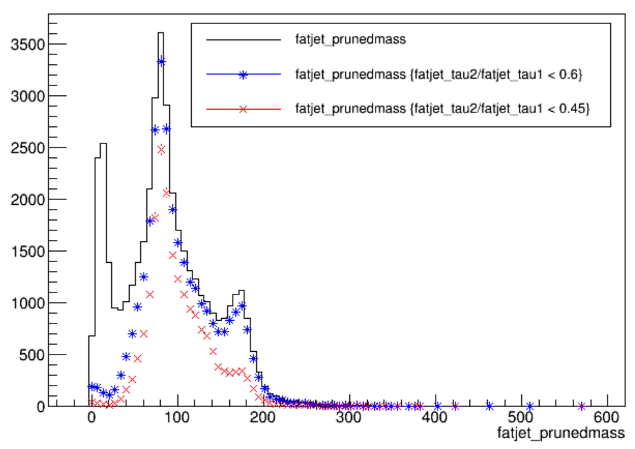
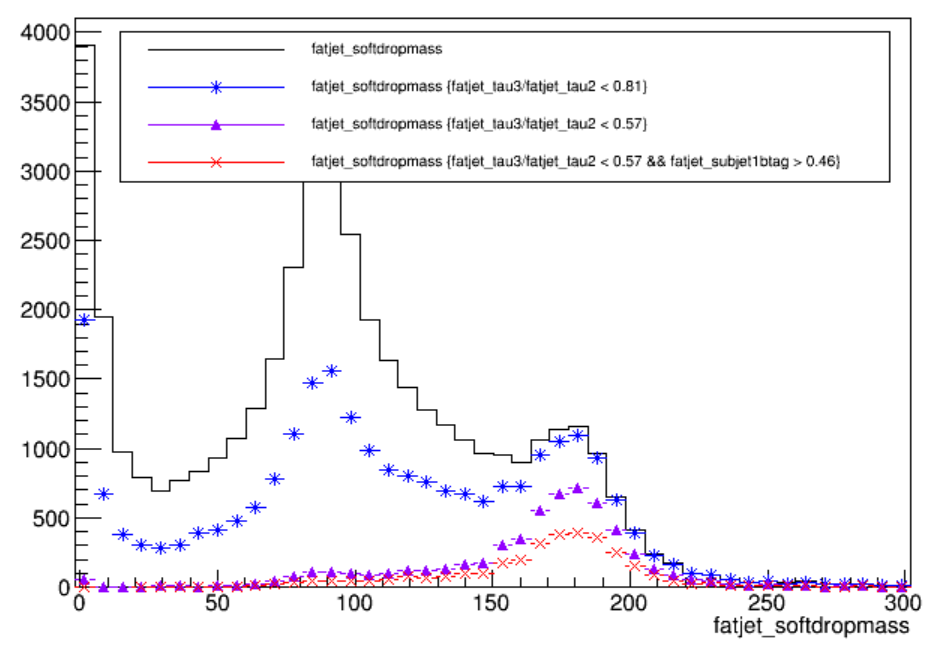

> ## Run POET (...maybe...)
> If you have not already, run POET using the entire top quark pair test file. In `python/poet_cfg.py` set the
> number of events to process to -1:
> ~~~
> #---- Select the maximum number of events to process (if -1, run over all events)
> process.maxEvents = cms.untracked.PSet( input = cms.untracked.int32(-1) )
> ~~~
> {: .language-python}
> ~~~
> #---- Define the test source files to be read using the xrootd protocol (root://), or local files (file:)
> process.source = cms.Source("PoolSource", fileNames = cms.untracked.vstring(
>         'root://eospublic.cern.ch//eos/opendata/cms/mc/RunIIFall15MiniAODv2/TT_Mtt-1000toInf_TuneCUETP8M1_13TeV-powheg-pythia8/MINIAODSIM/PU25nsData2015v1_76X_mcRun2_asymptotic_v12_ext1-> v1/80000/000D040B-4ED6-E511-91B6-002481CFC92C.root',
>         )
> )
> ~~~
> {: .language-python}
>
> And run POET using `cmsRun python/poet_cfg.py`.
{: .prereq}

Jets can originate from many different types of particles. The figure below gives an example of how different "parent particles" can influence the internal structure of a jet. Observables related to the **mass** and **internal structure** of a jet can help us design algorithms to distinguish between sources. The most common type of algorithm identifies **b quark jets** from light quark or gluon jets. The POET contains all the tools you need to evaluate the default CMS b tagging discriminants on small-radius jets. See the next episode for more information. In this lesson we will focus on tools to identify hadronic decays of Lorentz-boosed massive SM particles within large-radius jets.

## Jet mass and grooming

The mass of a jet is evaluated by summing the energy-momentum four-vectors of all the particle flow candidates that make up the jet and computing the mass of the resulting object. This mass calculation is distorted by the low-momentum and wide-angle gluon radiation emerging from the initial hadrons that formed the jet. For example, the masses of light quark or gluon jets are measured to be much larger than the actual masses of these particles -- typically 10--50 GeV with a smooth continuum to higher values. **Grooming** procedures can help reduce the impact of this radiation and bring the jet mass closer to the true values of the parent particles. Grooming algorithms typically cluster the jet's consitituents into "subjets", like those represented by the small circles in the figure below. The relationships between different subjets can then be tested to decide which to keep.

Four groomed masses are available for large-radius ("fat") jets in 2015 MiniAOD:

* Trimmed mass: jets are reclustered using a small distance parameter, and any "subjets" that have too small a fraction of the original jet momentum are discarded.
* Filtered mass: jets are reclustered using a small distance parameter, and a certain number of subjets are kept.
* **Pruned mass** (default for identifying W/Z/H boson jets): jets are reclustered, and at each step subjets that are too soft or at large angles are discarded.
* **Soft drop mass** (default for identifying t quark jets): jets are recursively de-clustered, and at each step jets that are too soft or at large angles are discarded.

In `FatjetAnalyzer.cc` the groomed masses are accessed via the "userFloat" method available in all PAT classes. This implies that a value has been calculated elsewhere and the result stored manually inside the PAT object. In the case of jet masses, it is important to note that userFloat values are not automatically corrected when "jet energy corrections" are applied. These corrections are covered in the last segment of this lesson -- in POET specific levels of correction are applied to the groomed masses.

~~~
fatjet_prunedmass.push_back(corrL2L3*(double)smearedFatjet.userFloat("ak8PFJetsCHSPrunedMass"));
fatjet_softdropmass.push_back(corrL2L3*(double)smearedFatjet.userFloat("ak8PFJetsCHSSoftDropMass"));
~~~
{: .language-cpp}

> ## Exercise: boosted particle momentum ranges
> Study the connection between jet mass and jet momentum -- what minimum transverse momentum is
> required for W boson and top quark jets to be found within a large-radius jet?
>
> Begin by opening the `myoutput.root` file you processed at the beginning of this segment.
> Use ROOT's capability to draw two-dimensional histograms to compare various jet masses against
> the jet's transverse momentum:
> ~~~
> $ root -l myoutput.root
> [1] _file0->cd("myfatjets");
> [2] Events->Draw("fatjet_<SOME MASS VARIABLE>:fatjet_corrpt","","colz"); // colz makes a heatmap
> ~~~
> {: .language-cpp}
>
>> ## Solution
>> 
>> This plot shows the relationship between momentum, mass, and jet radius. As the momentum increases, jets of larger mass become contained within
>> the fat jet. While W bosons can be observed from 200 GeV, top quarks require a higher momentum threshold.
> {: .solution}
{: .challenge}

## Jet substructure

The internal structure of a jet can be probed using many observables: [N-subjettiness](https://arxiv.org/abs/1011.2268?context=hep-ph), energy correlation functions, and others. In CMS, N-subjettiness is the default jet substructure variable for identifying boosted particle decays.

The "tau" variables of N-subjettiness, defined below, are jet shape variables whose value approaches 0 for jets having N or fewer subjets:

If the value approaches zero it indicates that the consitituents all lie near one of the previously identified subjet axes. For a top quark jet with 3 subjets, we would expect small tau values for N = 3, 4, 5, 6, etc, but larger values for N = 1 or 2.

Ratios of tau values provide the best discrimination for jets with a specific number of subjets. For two-prong jets like W, Z, or H boson decays, we study the ratio tau_2 / tau_1. For three-prong jets we study tau_3 / tau_2. 

In `FatjetAnalyzer.cc`, the N-subjettiness values are also accessed from userFloats:
~~~
fatjet_tau1.push_back((double)smearedFatjet.userFloat("NjettinessAK8:tau1"));
fatjet_tau2.push_back((double)smearedFatjet.userFloat("NjettinessAK8:tau2"));
fatjet_tau3.push_back((double)smearedFatjet.userFloat("NjettinessAK8:tau3"));
~~~
{: .language-cpp}

For top quark or H boson decays, applying b tagging algorithms to the subjets of the large-radius
jets gives another valuable substructure observable. The Combined Secondary Vertex v2 discriminant, described in detail in the next episode, has been stored for the two subjets obtained from the soft drop algorithm in each large-radius jet. For simulation, we also store the generator-level flavor information for the subjet.

~~~
auto const & sdSubjets = smearedFatjet.subjets("SoftDrop");
int nSDSubJets = sdSubjets.size();
if(nSDSubJets > 0){
    pat::Jet subjet1 = sdSubjets.at(0);
    fatjet_subjet1btag.push_back(subjet1.bDiscriminator("pfCombinedInclusiveSecondaryVertexV2BJetTags"));
    fatjet_subjet1hflav.push_back(subjet1.hadronFlavour());
}else{
    fatjet_subjet1btag.push_back(-999);
    fatjet_subjet1hflav.push_back(-999);
}
// then the same for the 2nd subjet
~~~
{: .language-cpp}

> ## Exercise: mass and N-subjettiness correlations
> Study the correlation between groomed jet mass and N-subjettiness ratios.
> Make 2D plots of either pruned jet mass versus tau_2/tau_1, or softdrop jet mass versus tau_3/tau_2.
> Where do the various parent particles of the jets pool?
> What requirements would effectively select W bosons or top quarks?
> Tip: use the same type of ROOT Draw command as in the previous exercise.
>
>> ## Solution
>> The structure in the tau_2/tau_1 plot is very unique: W bosons pool at lower values of tau_2/tau_1, while top quarks
>> (with more than 2 subjets) and light quarks (with only 1 subjet) pool at medium and higher values.
>> In the tau_3/tau_2 plot, top quark jets have low values while both W boson and light quark jets are gathered near 1.
>> The correlations in these plots lead directly to the "tagging" criteria introduced in the next section.
>> 
>> 
>{: .solution}
{: .challenge}

## W and top tagging

The CMS jet algorithms group studied the efficiency of identifying known W boson jets using almost 30 different combinations of groomed mass and jet substructure variables. The optimal combination for 2015 data was pruned mass + tau_2/tau_1 for large-radius jets using the CHS pileup mitigation technique. For "PUPPI" jets, developed for Run 2, the softdrop mass is used instead. The use of PUPPI jets became the default for CMS analyses beginning only in 2016, so currently this option is not implemented in the POET.

Selection criteria for W boson and top quark jets in 2015 data analyses are described in [this Physics Analysis Summary](http://cds.cern.ch/record/2256875), including the calculations of corrections factors for simulation. 

> ### W boson selections
> A W jet has pruned mass between 65 -- 105 GeV and tau_2/tau_1 less than a chosen upper bound.
> The supported working points and their correction factors are shown in this table:
> 
> 
{: .callout}

For top quarks, the soft drop mass is used regardless of pileup mitigation technique for the jets. In this case, tau_3/tau_2 becomes the most useful substructure variable, followed by b quark tagging applied on the individual subjets of the large-radius jet.

> ### Top quark selections
> A top quark jet has soft drop mass between 105 -- 220 GeV, tau_3/tau_2 less than a chosen upper
> bound, and possibly a requirement on a subjet b quark tag. The supported working points, their
> efficiencies, and correction factors are shown in this table:
> 
> 
{: .callout}

> ## Exercise: explore jet tagging criteria
> Study the connection between groomed mass, n-subjettiness ratios, and subjet b-tagging.
> From the top quark events in `myoutput.root`, can you see either a W boson or top quark mass
> peak become visible in the `fatjet_prunedmass` or `fatjet_softdropmass` distribution as you
> apply the various substructure criteria?
>
> Recall: `Events->Draw("fatjet_X","fatjet_Y > VALUE")` will draw the branch `fatjet_X` for all
> events in which `fatjet_Y > VALUE`. Adding a third parameter to the Draw command that says "same"
> will place a new histogram on top of any existing histograms.
>
> Criteria you could test include:
> * `fatjet_tau2/fatjet_tau1 < 0.6`
> * `fatjet_tau2/fatjet_tau1 < 0.45`
> * `fatjet_corrpt > 500`
> * `fatjet_tau3/fatjet_tau2 < 0.81`
> * `fatjet_tau3/fatjet_tau2 < 0.57`
> * `fatjet_subjet1btag > .046`
>
>> ## Solution
>> Both the W boson jets and the top quark jets can be isolated from the other jet types quite
>> effectively with the N-subjettiness criteria!
>> 
>> 
>{: .solution}
{: .challenge}



